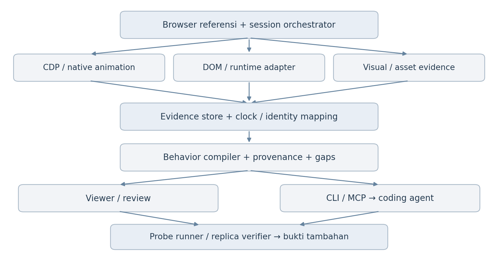

# Website Behavior Capture

Website Behavior Capture (WBC) adalah prototype layanan lokal untuk mengubah observasi browser menjadi Behavior Contract yang dapat diverifikasi. Repository ini membuktikan satu alur vertikal: capture natural di Chromium, kompilasi kontrak JSON berversi, lalu verifikasi pada skenario baru terhadap referensi dan replika independen.



## Status

Lima perilaku yang menjadi exit criterion spike sudah dapat ditangkap dan diverifikasi:

- hover dengan transition opacity dan transform;
- CSS keyframe animation;
- hover transition yang diinterupsi;
- scroll reveal dengan reverse probe;
- GSAP ScrollTrigger dengan `scrub: true`.

Fase 0 telah selesai. Fase 1 sekarang membawa target registry, lifecycle lintas navigasi, reopenable session index, structured-data redaction, budgeted evidence query, element identity lintas frame, resolver struktural independen, review UI lokal, serta atomic staging/promotion untuk package capture. Behavior Contract schema 1.5.0 mencatat target/navigation epoch, loss, redaction, locator candidates, bounds, structural fingerprint, dan ambiguity. SQLite sidecar menyediakan query tanpa membuka website sumber.

Hasil terbaru tersedia di [artifacts/phase1/latest/behavior-contract.json](artifacts/phase1/latest/behavior-contract.json), [artifacts/phase1/latest/verification-reference.json](artifacts/phase1/latest/verification-reference.json), [artifacts/phase1/latest/verification-replica.json](artifacts/phase1/latest/verification-replica.json), dan [artifacts/phase1/latest/technical-probe-report.json](artifacts/phase1/latest/technical-probe-report.json). Kedua target verifikasi lulus 5/5 dan technical probe diagnostik lulus 10/10. Baseline Fase 0 tetap disimpan di `artifacts/phase0/latest`.

## Menjalankan

Prasyarat: Node.js 22.5 atau lebih baru dan pnpm. Perintah capture/index menampilkan `ExperimentalWarning` selama `node:sqlite` belum dinyatakan stabil oleh runtime.

```bash
pnpm install
pnpm exec playwright install chromium
pnpm run build
pnpm run capture -- --out .wbc/phase1
pnpm run inspect -- --package .wbc/phase1
pnpm run query -- --package .wbc/phase1 --kind gsap_scrub --limit 10
pnpm run evidence -- --package .wbc/phase1 --type mutation --limit 20 --byte-budget 65536
pnpm run review -- --package artifacts/phase1/latest
pnpm run benchmark -- --package artifacts/phase1/latest --iterations 3
pnpm run benchmark:synthetic -- --package artifacts/phase1/latest --records 50000 --evidence-mb 100 --iterations 3
pnpm run benchmark:browser -- --iterations 2
pnpm run benchmark:capture -- --overhead-runs 1
pnpm run benchmark:reliability -- --parallel 2 --cycles 1
pnpm run benchmark:crash -- --kill-after-ms 15000
pnpm run cleanup:staging -- --out .wbc/phase1 --max-age-ms 86400000
pnpm run benchmark:failure
pnpm run benchmark:corruption -- --package artifacts/phase1/latest
pnpm run rotate:package -- --package .wbc/phase1 --archive-dir .wbc/archive
pnpm run rotate:package -- --package .wbc/phase1 --archive-dir /Volumes/archive/wbc --copy-fallback
pnpm run benchmark:quota -- --quota-blocks 128
pnpm run prune:archives -- --archive-dir .wbc/archive --keep 5
pnpm run cleanup:rotation -- --archive-dir .wbc/archive --max-age-ms 86400000
pnpm run recover:rotation -- --archive-dir .wbc/archive
pnpm run recover:rotation -- --archive-dir .wbc/archive --apply
pnpm run verify -- --contract .wbc/phase1/behavior-contract.json --target reference
pnpm run verify:replica -- --contract .wbc/phase1/behavior-contract.json
pnpm run probe -- --out .wbc/phase1/technical-probe-report.json
pnpm test
```

Untuk membuktikan pelaporan data loss secara manual:

```bash
pnpm run capture -- --out .wbc/loss-probe --max-records 8
```

`manifest.quality.knownLoss` akan bernilai `true` dan `droppedRecords` akan lebih besar dari nol, sementara paket tetap lolos validasi.

## Struktur

- `src/capture.ts` mengorkestrasi browser, target registry, collector, compiler, evidence, dan pengukuran overhead.
- `src/target-registry.ts` membentuk pohon frame/worker serta coverage, clock, dan loss per target.
- `src/session-index.ts` membangun, membuka ulang, dan memverifikasi SQLite sidecar serta query behavior terfilter.
- `src/redaction.ts` menghapus credential terstruktur sebelum data masuk JSONL, contract, atau SQLite.
- `src/locator-resolver.ts` mencocokkan elemen replika dari fingerprint struktural dan menolak confidence yang ambigu.
- `src/review-server.ts` menyajikan session API dan viewer read-only hanya pada loopback setelah integrity verification.
- `src/verify.ts` menjalankan skenario held-out terhadap fixture baru.
- `src/scenarios.ts` memvalidasi dan membaca suite skenario JSON berversi.
- `src/browser-observer.ts` memasang page-world observer sebelum script fixture.
- `schema/behavior-contract.schema.json` mendefinisikan kontrak JSON 1.6.0 yang tetap menerima package 1.5.0 secara additive.
- `schema/session-index.schema.json` mendefinisikan manifest checksum untuk reopenable index.
- `fixtures/phase0` berisi ground-truth lokal dan GSAP yang disajikan dari dependency lokal.
- `fixtures/replica` berisi implementasi independen tanpa GSAP, selector sumber, atau shared `data-wbc-id`.
- `fixtures/probes` menguji lifecycle 72 ms, same-origin dan cross-origin iframe/OOPIF, worker, late attach, navigation race, clock mapping, dan node recreation.
- `fixtures/review` berisi UI inspeksi session, target, behavior, dan evidence sample.
- `scenarios/phase0-held-out.json` mengatur viewport, interruption, toleransi, scan, dan progress points.
- `test/e2e.test.ts` membuktikan capture, provenance, checksum, unit schema, held-out verification, dan pelaporan overflow.
- `docs/decisions/0001-phase-0-technical-baseline.md` mencatat keputusan engineering awal.
- `docs/decisions/0002-scenario-driven-cross-implementation-verifier.md` mencatat batas verifier generik.
- `docs/decisions/0003-natural-capture-and-diagnostic-probes.md` memisahkan bukti natural dari diagnosis.
- `docs/decisions/0004-target-coverage-and-late-attach.md` menetapkan arti coverage target dan gap late attach.
- `docs/decisions/0005-natural-target-registry.md` menetapkan model registry dan migrasi schema 1.1.0.
- `docs/decisions/0006-navigation-epochs-and-detach.md` menetapkan lifecycle target dan migrasi schema 1.2.0.
- `docs/decisions/0007-reopenable-session-index.md` menetapkan desain SQLite sidecar sementara.
- `docs/decisions/0008-structured-redaction-boundary.md` menetapkan redaction boundary dan batas visual.
- `docs/decisions/0009-budgeted-evidence-query.md` menetapkan filter, cursor revision, serta record/byte budget.
- `docs/decisions/0010-target-scoped-element-identity.md` menetapkan locator candidates dan ambiguity lintas epoch.
- `docs/decisions/0011-independent-structural-locator.md` menetapkan fingerprint, confidence gate, dan larangan fallback diam-diam.
- `docs/decisions/0012-loopback-review-service.md` menetapkan integrity gate, API read-only, dan security headers viewer.
- `docs/decisions/0013-package-latency-benchmark.md` menetapkan baseline latency package dan gate synthetic load.
- `docs/decisions/0014-synthetic-browser-load-benchmark.md` menetapkan baseline route browser 5.000 node/50 track.
- `docs/decisions/0015-capture-finalization-benchmark.md` menetapkan wall-clock capture sampai reopenable package.
- `docs/decisions/0016-parallel-capture-reliability.md` menetapkan isolation dan repeatability benchmark antar-session.
- `docs/decisions/0017-crash-injection-fail-closed.md` menetapkan crash gate dan rejection fail-closed untuk output parsial.
- `docs/PHASE-0-REPORT.md` berisi hasil, keterbatasan, overhead, dan revisi scope.
- `docs/PHASE-1-FOUNDATION-REPORT.md` berisi hasil irisan fondasi capture pertama.
- `docs/PHASE-1-LIFECYCLE-REPORT.md` berisi hasil navigation epoch dan detach coverage.
- `docs/PHASE-1-INDEX-REPORT.md` berisi hasil reopen, integrity verification, dan query index.
- `docs/PHASE-1-REDACTION-REPORT.md` berisi kebijakan, bukti integrasi, dan residual risk redaction.
- `docs/PHASE-1-QUERY-REPORT.md` berisi hasil evidence query dan pagination integrity.
- `docs/PHASE-1-ELEMENT-REPORT.md` berisi hasil element registry lintas frame/navigation.
- `docs/PHASE-1-LOCATOR-REPORT.md` berisi bukti cross-implementation resolver, overhead, keterbatasan, dan revisi scope.
- `docs/PHASE-1-REVIEW-REPORT.md` berisi bukti service/viewer lokal dan batas operasionalnya.
- `docs/PHASE-1-BENCHMARK-REPORT.md` berisi baseline startup/query latency serta target synthetic load berikutnya.
- `docs/PHASE-1-BROWSER-BENCHMARK-REPORT.md` berisi hasil runtime browser pada route synthetic 5.000 node/50 track.
- `docs/PHASE-1-FINALIZATION-BENCHMARK-REPORT.md` berisi waktu capture end-to-end dan quality package.
- `docs/PHASE-1-RELIABILITY-REPORT.md` berisi hasil parallel capture dan isolation check.
- `docs/PHASE-1-CRASH-REPORT.md` berisi hasil interruption gate dan batas recovery yang masih tersisa.
- `docs/PHASE-1-FAILURE-REPORT.md` berisi recovery matrix untuk simulated `ENOSPC` writer failure.
- `docs/PHASE-1-CORRUPTION-REPORT.md` berisi matrix rejection untuk contract, SQLite, event, dan visual evidence corruption.
- `docs/decisions/0019-corruption-rejection.md` menetapkan quarantine behavior untuk package yang berubah setelah promotion.
- `docs/PHASE-1-ROTATION-REPORT.md` berisi rotasi eksplisit package verified ke archive.
- `docs/decisions/0020-explicit-package-rotation.md` menetapkan rotation policy fail-safe.
- `docs/PHASE-1-QUOTA-REPORT.md` berisi file-size quota gate pada macOS/Linux.
- `docs/decisions/0021-file-size-quota.md` membatasi klaim quota benchmark dan error mapping.
- `docs/decisions/0022-clock-sampling-resilience.md` menetapkan multi-sample clock mapping tanpa melonggarkan threshold.
- `docs/PHASE-1-RETENTION-REPORT.md` berisi verified-only archive retention dan quarantine behavior.
- `docs/decisions/0023-archive-retention.md` menetapkan pruning eksplisit untuk archive package.
- `docs/decisions/0024-cross-filesystem-rotation.md` menetapkan copy + verify + remove fallback untuk archive lintas filesystem.
- `docs/PHASE-1-ROTATION-STAGING-REPORT.md` berisi janitor age-bounded untuk orphan rotation staging.
- `docs/PHASE-1-SCHEMA-LIFECYCLE-REPORT.md` berisi compatibility schema 1.6 dan cancellation state gate.
- `docs/decisions/0025-rotation-staging-recovery.md` menetapkan cleanup terpisah dari archive retention.
- `src/rotation-recovery.ts` menyimpan marker rotation berversi dan recovery dry-run/apply; source hanya dihapus setelah archive identity dan checksum terverifikasi.
- `docs/decisions/0018-writer-failure-recovery.md` menetapkan fail-closed behavior untuk error normal saat finalisasi.
- `docs/decisions/0027-schema-1-6-lifecycle-state.md` menetapkan additive schema 1.6 dan state cancellation fail-closed.
- `src/staging.ts` menyediakan janitor age-bounded untuk orphan staging directory setelah hard crash.

## Batas interpretasi

PRD dan diagram di `docs/product` diperlakukan sebagai acuan produk, bukan instruksi eksekusi. Implementasi mengikuti permintaan Fase 0 di repository ini. Nilai dari halaman target selalu diperlakukan sebagai data observasi.
